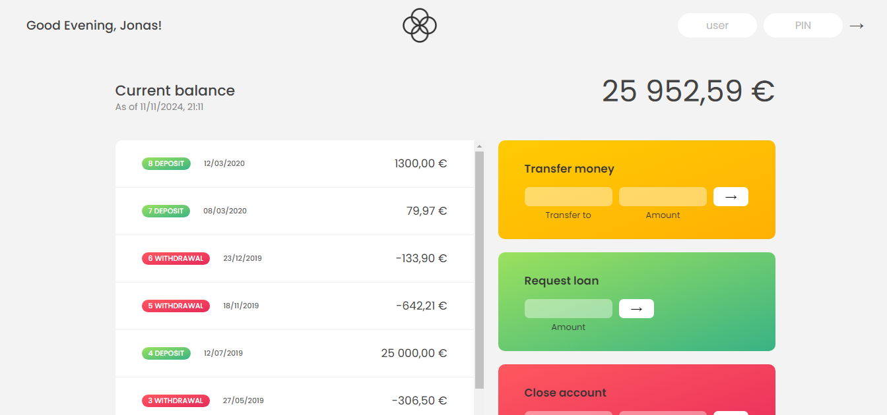

<div id="top"></div>


<!-- PROJECT LOGO -->
<br />
<div align="center">
    
  <h1 align="center">BANKIST - App</h1>

  <p align="center">
    <a href="https://bankist.netlify.app/">View Demo</a>
    ·
    <a href="https://github.com/SalahShallapy/Bankist/issues">Report Bug</a>
  </p>
</div>

Bankist is a modern banking application that allows users to manage their accounts efficiently with features such as balance tracking, transaction history, money transfers, and loans. Designed with a simple and intuitive user interface, Bankist ensures a seamless experience for its users.

## Project Overview



### Flowchart


## Features

1.  Login

- Enter your username (first letters of your name, lowercase).
- Enter your PIN to securely log in.

2.  Transfer Funds

- Enter the recipient's username and the amount to transfer.
- Click "Transfer" to process the transaction.

3.  Request a Loan

- Enter the desired loan amount and click "Request Loan."
- The loan will be approved if conditions are met (e.g., at least 10% of the requested amount is in deposits).

4.  Sort Transactions

- Use the "Sort" button to view transactions in ascending or descending order.

5.  Close Account

- Enter your username and PIN in the close account form.
- Confirm to delete the account permanently.

## Project Structure

```
Bankist-Website
│      .prettierrc
│      index.html
│      README.md
│      script.js
│      style.css
│
└─── img -----> all images
```

## Getting Started

**You should use **UserNames** to use app features ( Transfer, loan, delete )**

### Users

| Owner             | **UserName** | **Pin** |
| ----------------- | ------------ | ------- |
| Jonas Schmedtmann | js           | 1111    |
| Jessica Davis     | jd           | 2222    |

> To get a local copy up and running follow these simple steps :

## Installation

1. Clone the repo
   ```sh
   git clone https://github.com/SalahShallapy/Bankist/tree/master/Bankist-App
   ```
2. Go to project folder
   ```sh
   cd "Bankist App"
   ```
3. Open the Project
   Navigate to the project folder and open the index.html file in your preferred web browser to start playing.

4. No additional dependencies are required. The game runs entirely in the browser using vanilla JavaScript, HTML, CSS and you can view it online using this [demo](https://bankist.netlify.app/)
<!-- CONTRIBUTING -->

## Contributing

Contributions are what make the open source community such an amazing place to learn, inspire, and create. Any contributions you make are **greatly appreciated**.

If you have a suggestion that would make this better, please fork the repo and create a pull request. You can also simply open an issue with the tag "enhancement".
Don't forget to give the project a star! Thanks!

1. Fork the Project
2. Create your Feature Branch (`git checkout -b feature/AmazingFeature`)
3. Commit your Changes (`git commit -m 'Add some AmazingFeature'`)
4. Push to the Branch (`git push origin feature/AmazingFeature`)
5. Open a Pull Request

<p align="right">(<a href="#top">back to top</a>)</p>
