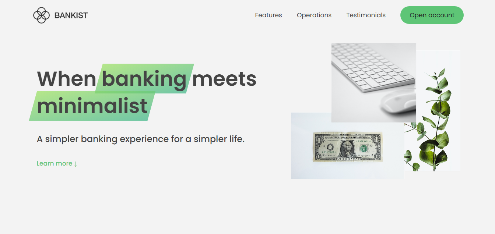

<div id="top"></div>


<!-- PROJECT LOGO -->
<br />
<div align="center">
    
    <h1 align="center">BANKIST - Website</h1>

  <p align="center">
    <a href="https://bankist-dom.netlify.app/">View Demo</a>
    .
    <a href="https://github.com/SalahShallapy/Bankist/issues">View Demo</a>
  </p>
</div>

Bankist is a modern and interactive landing page showcasing advanced front-end development skills. This project implements smooth scrolling, lazy loading, tabbed content, and a functional image slider. It serves as an excellent demonstration of DOM manipulation, event-driven programming, and optimized UI/UX practices.

<!-- TABLE OF CONTENTS -->
<details>
  <summary>Table of Contents</summary>
  <ol>
    <li>
      <a href="#about-the-project">About The Project</a>
      <ul>
        <li><a href="#built-with">Built With</a></li>
      </ul>
    </li>
    <li>
      <a href="#getting-started">Getting Started</a>
      <ul>
        <li><a href="#installation">Installation</a></li>
      </ul>
    </li>
    <li><a href="#contributing">Contributing</a></li>
  </ol>
</details>

<!-- ABOUT THE PROJECT -->

## Project Overview



## Features

- Modal window:

  - Displays a modal window for information or actions.
  - Opens on button click, closes on overlay click or Escape key.

- Smooth Scrolling:

  - Implements smooth scrolling to sections using native DOM methods.

- Page Navigation:

  - Enables navigation to specific sections by clicking links in the navigation bar.

- Tabbed Components:

  - Switch between content areas using tabbed navigation with active states.

- Sticky Navigation:

  - Uses Intersection Observer API to create a sticky header when scrolling past the hero section.

- Section Reveal on Scroll:

  - Unveils content sections dynamically as they enter the viewport.

- Lazy Loading Images:

  - Loads high-resolution images just before they appear in the viewport to optimize performance.

- Image Slider:

  - Includes a slider with navigation buttons and keyboard control.
  - Supports dot-based navigation to jump between slides.

- Menu Hover Effects:
  - Highlights the navigation link being hovered while dimming others.

## Project Structure

```
Bankist-Website
│      .prettierrc
│      index.html
│      README.md
│      script.js
│      style.css
│
└─── img -----> all images
```

## Installation

1. Clone the repo
   ```sh
   git clone https://github.com/SalahShallapy/Bankist/tree/master/Bankist-Website
   ```
2. Go to project folder
   ```sh
   cd "Bankist Website"
   ```
3. Open the Project
   Navigate to the project folder and open the index.html file in your preferred web browser to start playing.

4. Requirements
   No additional dependencies are required. The game runs entirely in the browser using vanilla JavaScript, HTML, CSS and you can view it online using this [demo](https://bankist-dom.netlify.app/)

## Contributing

Contributions are what make the open source community such an amazing place to learn, inspire, and create. Any contributions you make are **greatly appreciated**.

If you have a suggestion that would make this better, please fork the repo and create a pull request. You can also simply open an issue with the tag "enhancement".
Don't forget to give the project a star! Thanks!

1. Fork the Project
2. Create your Feature Branch (`git checkout -b feature/AmazingFeature`)
3. Commit your Changes (`git commit -m 'Add some AmazingFeature'`)
4. Push to the Branch (`git push origin feature/AmazingFeature`)
5. Open a Pull Request

<p align="right">(<a href="#top">back to top</a>)</p>
